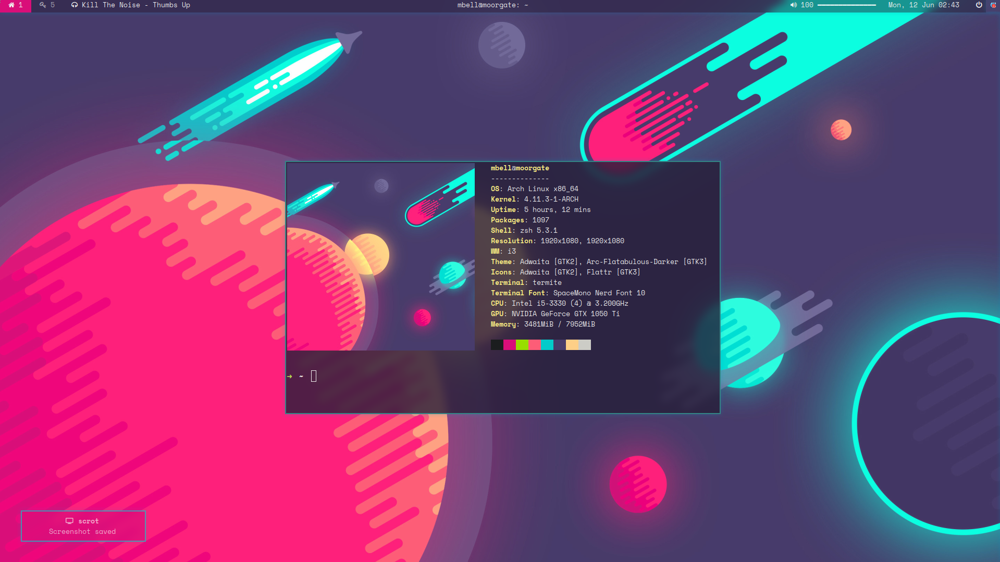

Configs
=======

Desktop uses the configs in the space directory.

Laptop uses the configs in the pixel directory.

Configurator tool to come soon(tm).

To apply a theme, run `./apply.sh $theme`, where `$theme` is the choice of theme
(currently pixel or space). Leave blank for the default (pixel).

# Previews

## Space

# Vim keyboard shortcuts

| description         | key           |
|---------------------|---------------|
| Leader key:         | `-`           |
|---------------------|---------------|
| Move to split below | `<C-W> <C-J>` |
| Move to split above | `<C-W> <C-K>` |
| Move to split left  | `<C-W> <C-H>` |
| Move to split right | `<C-W> <C-L>` |
|---------------------|---------------|
| Stage current file  | `-gw`         |
| File tree           | `-e`          |
| File tree (all tabs)| `-E`          |
| Tagbar              | `<F8>`        |
|---------------------|---------------|
| Toggle focused mode | `<F2>`        |
|---------------------|---------------|
| Expand code snippet | `<C-k>`       |
| Undo completion     | `<C-g>`       |
| Complete string     | `<C-l>`       |
| Cancel completion   | `<C-h>`       |
| Cancel completion   | `<BS>`        |
|---------------------|---------------|
| LaTeX word count    | `<F3>`        |
|---------------------|---------------|

# i3 keyboard shortcuts

| description         | key               |
|---------------------|-------------------|
| modifier (`$mod`)   | `Super`           |
|---------------------|-------------------|
| Open terminal       | `$mod+return`     |
|---------------------|-------------------|
| Close window        | `$mod+shift+q`    |
| Move left window    | `$mod+left`       |
| "                   | `$mod+j`          |
| Move right window   | `$mod+right`      |
| "                   | `$mod+;`          |
| Move up window      | `$mod+up`         |
| "                   | `$mod+l`          |
| Move down window    | `$mod+down`       |
| "                   | `$mod+k`          |
| Swap left windows   | `$mod+shift+left` |
| "                   | `$mod+shift+j`    |
| Swap right windows  | `$mod+shift+right |
| "                   | `$mod+shift+;`    |
| Swap up windows     | `$mod+shift+up`   |
| "                   | `$mod+shift+l`    |
| Swap down windows   | `$mod+shift+down` |
| "                   | `$mod+shift+k`    |
| Split horizontally  | `$mod+h`          |
| Split vertically    | `$mod+v`          |
| Toggle fullscreen   | `$mod+f`          |
| Toggle floating     | `$mod+shift+space`|
| Focus floating win  | `$mod+space`      |
| Focus parent        | `$mod+a`          |
| Focus child         | `$mod+shift+a`    |
| Goto workspace `$i` | `$mod+$i`         |
| Move workspace `$i` | `$mod+shift+$i`   |
|---------------------|-------------------|
| Reload config       | `$mod+shift+c`    |
| Restart i3          | `$mod+shift+r`    |
|---------------------|-------------------|
| Layout: stack       | `$mod+s`          |
| Layout: tab         | `$mod+w`          |
| Toggle split dir    | `$mod+e`          |
|---------------------|-------------------|
| Toggle scratchpad   | `$mod+<F2>`       |
|---------------------|-------------------|
| Toggle resize mode  | `$mod+r`          |
| Shrink width        | `$mod+left`       |
| "                   | `$mod+j`          |
| Expand width        | `$mod+right`      |
| "                   | `$mod+;`          |
| Shrink height       | `$mod+up  `       |
| "                   | `$mod+l`          |
| Expand height       | `$mod+down`       |
| "                   | `$mod+k`          |
|---------------------|-------------------|
| Main menu           | `$mod+d`          |
| Screenshot menu     | `$mod+shift+prtscr`|
| Screenshot          | `$mod+prtscr`     |
| Power menu          | `$mod+q`          |
|---------------------|-------------------|
| Play/pause          | `$mod+shift+p`    |
| "                   | `Media Play`      |
| Next track          | `$mod+shift+.`    |
| "                   | `Media Next`      |
| Prev track          | `$mod+shift+,`    |
| "                   | `Media Prev`      |
|---------------------|-------------------|
